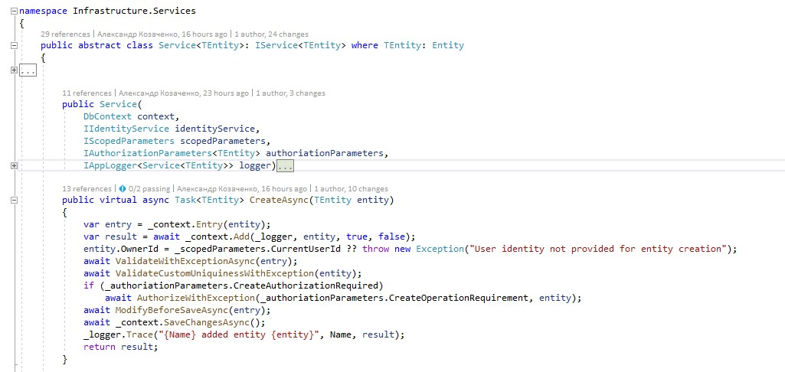
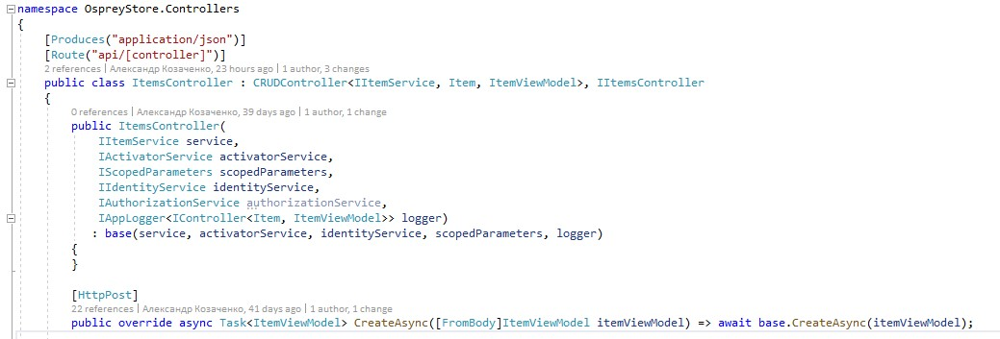
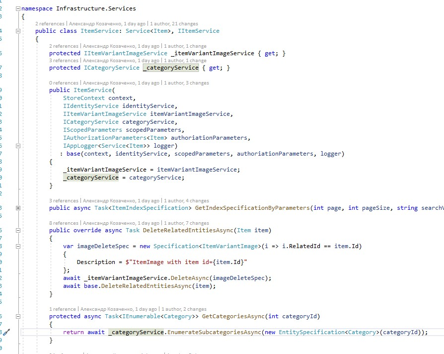

# Osprey Store

Osprey Store is web store platform providing marketplace for the sellers and the customers.  It was created with a purpose to became familiar and implement software with some fancy frameworks and patterns. Inspired by <a href="https://github.com/dotnet-architecture/eShopOnWeb">Microsoft reference solution</a>.
Please note that it was desined to look good on any screen.
I hope you can find some useful pieces of code there.

Frameworks used
---
- ASP.NET Core 2.1
- NET Standard 2.0
- Angular 7
- Bootstrap 4

Core patterns and principles
---
- SOLID principles
- Clean Architecture
- Testability
- RESTful web services
- Microservices
- Adaptive Layout
- Web Application

### SOLID

#### S—Single responsibility principle
Each component designed for one thing and has minimal knowledge of outside components and their logic. For example, each service is responsible for lifecycle of it's entity, and supposed to be changed if and only if this lifecycle changes. Although one component may depend on the other one, implementation details are hidden behind it's abstractions.

#### O—Open/closed principle
Generally the process of creating an entity is similar between different services 

When we need to add file to storage while creating an entity (ItemVariantImageService), this general process could be easily extended while still keeping and reusing the original logic

#### L-Liskov substitution principle
Controllers rely on services to create/read/update/delete entities. Although the internal logic may differ greatly from service to service, in the end it's just generic controller calling generic service while passing some arguments.

#### I-Interface segregation principle
As already mentioned, service may rely on other services, but only does so through interfaces. In this example, ItemService requires ICategoryService to filter by category and IItemVariantImageService to maintain database consistency.

#### D-Dependency inversion principle
Accrording to Clean Architecture principles, the most important one is the dependancy inversion principle which is the pillar of the clean architecture.
While there are still some references from OspreyStore to Infrastructure, it's only limited to database seeding and DI setup, as it's shown on a graph below.

### Installing

Just clone and run server, no special actions required

